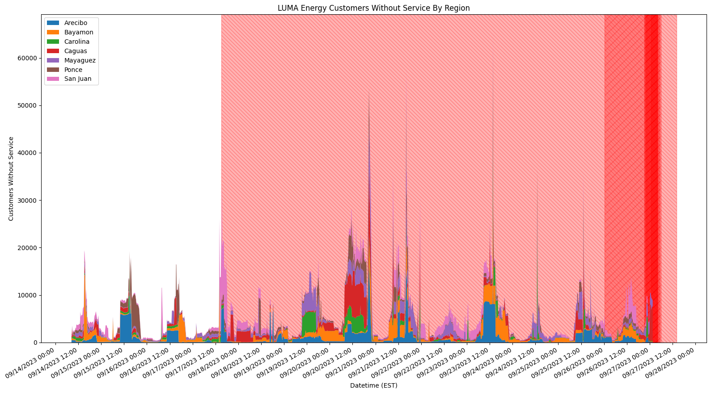

# LUMA Energy Outages
Tracking outages for Puerto Rico's private electricity distributor with GitHub Actions.

## The Outage Graph

The spans in the background represent [notable outages](#whats-being-tracked). Scheduled ones are left-leaning yellow and unplanned ones are right-leaning red.

## What's Being Tracked

* [Service Status (numbers of customers with and without power across Luma's 7 regions)](https://miluma.lumapr.com/outages/serviceStatus) in `customers_without_service.json`
* [Service Updates/Notable Outages (listings of known and planned outages with explanations)](https://lumapr.com/notable-outages/?lang=en) in `notable_outages.csv` 
* [Outage Map (what sectors in each of LUMA's regions are without power)](https://miluma.lumapr.com/outages/outageMap)

