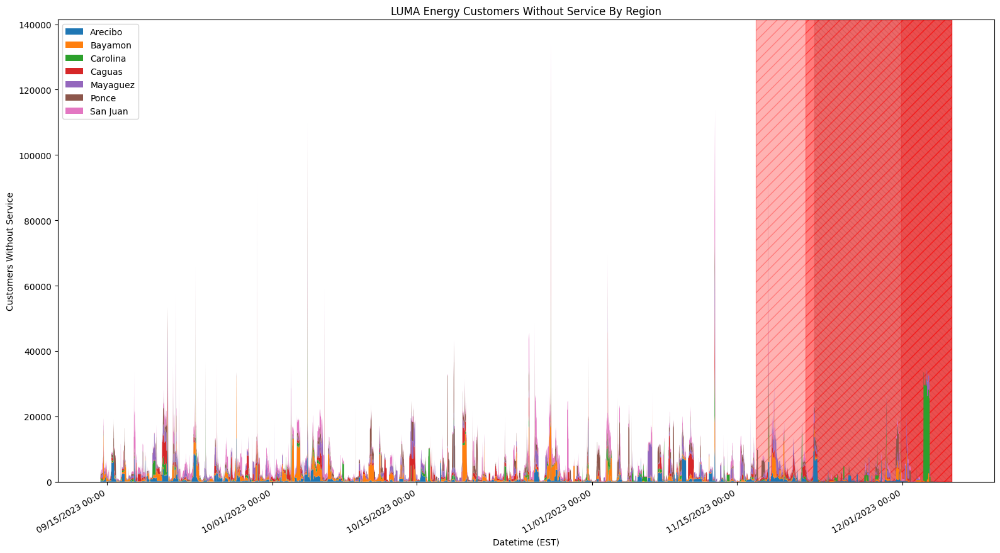

# luma-energy-outages
Tracking outages for Puerto Rico's private electricity distributor with GitHub Actions.

The spans in the background represent [notable outages](https://lumapr.com/notable-outages/?lang=en). Scheduled ones are left-leaning yellow and unplanned ones are right-leaning red.
